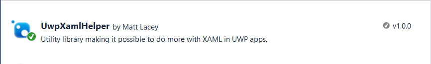
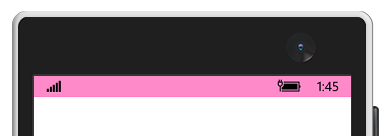
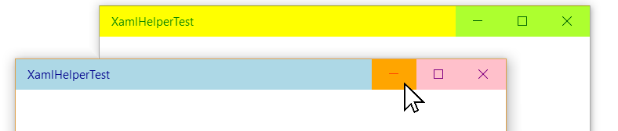

# UWP XAML Helper
Set the StatusBar (mobile) or TitleBar (desktop) in XAML of your UWP app.

You don't need to do anything in code behind or even add references to the extension libraries in your project. Just install via NuGet.



Set either the MobileStatusBar, the DesktopTitleBar, or both.


## [Mobile]StatusBar


```csharp
<Page
    x:Class="XamlHelperTest.MainPage"
    xmlns="http://schemas.microsoft.com/winfx/2006/xaml/presentation"
    xmlns:x="http://schemas.microsoft.com/winfx/2006/xaml"
    xmlns:uxh="using:UwpXamlHelper"
    uxh:MobileStatusBar.IsVisible="True"
    uxh:MobileStatusBar.BackgroundOpacity="0.5"
    uxh:MobileStatusBar.BackgroundColor="DeepPink"
    uxh:MobileStatusBar.ForegroundColor="Black"
    >
```
Will create this when on a mobile device. No impact on desktop.




## [Desktop]TitleBar


```csharp
<Page
    x:Class="XamlHelperTest.MainPage"
    xmlns="http://schemas.microsoft.com/winfx/2006/xaml/presentation"
    xmlns:x="http://schemas.microsoft.com/winfx/2006/xaml"
    xmlns:uxh="using:UwpXamlHelper"

    uxh:DesktopTitleBar.BackgroundColor="LightBlue"
    uxh:DesktopTitleBar.ForegroundColor="DarkBlue"
    uxh:DesktopTitleBar.ButtonBackgroundColor="Pink"
    uxh:DesktopTitleBar.ButtonForegroundColor="Purple"
    uxh:DesktopTitleBar.ButtonHoverBackgroundColor="Orange"
    uxh:DesktopTitleBar.ButtonHoverForegroundColor="OrangeRed"
    uxh:DesktopTitleBar.ButtonPressedBackgroundColor="Red"
    uxh:DesktopTitleBar.ButtonPressedForegroundColor="DarkRed"
    
    uxh:DesktopTitleBar.InactiveBackgroundColor="Yellow"
    uxh:DesktopTitleBar.InactiveForegroundColor="Green"
    uxh:DesktopTitleBar.ButtonInactiveBackgroundColor="GreenYellow"
    uxh:DesktopTitleBar.ButtonInactiveForegroundColor="DarkGreen"
    >
```

Will create this when on a desktop device. No impact on mobile.



